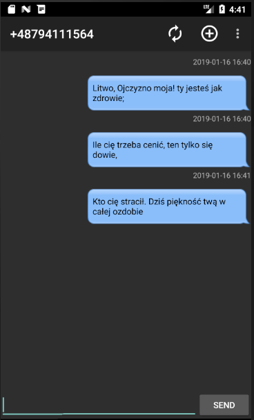
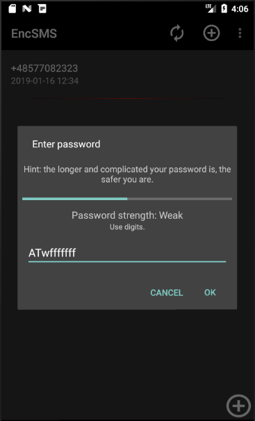
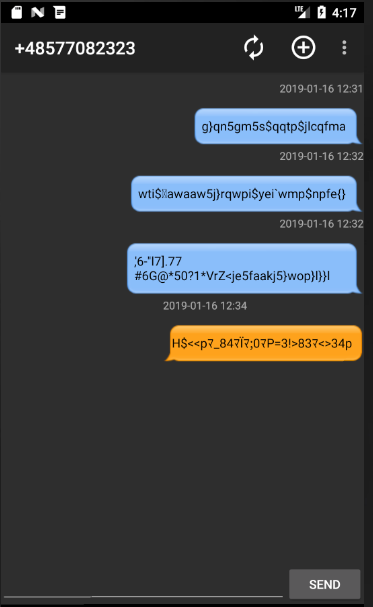

# Koksownik
Simple SMS app with message encoding by password. 

## Info
SMS messages are encoded with a password provided by the user. Encoding algorithm guarantees that all characters will be visible ASCII characters. Passwords are not stored so using wrong one to open conversation still causes decoding but the result is other than original.

## Screenshot
 
  
When wrong password entered 
 

# Credits
The Apache Software Foundation - for Apache Commons IO jar library - licensed under Apache License, Version 2.0 
Google - for Material design icons - licensed under Apache License, Version 2.0 

# License
EncSMS is licensed under Apache License 2.0 (see [LICENSE](./LICENSE)) and uses third party libraries that are distributed under their own terms (see [LICENSE-3RD-PARTY.txt](./LICENSE-3RD-PARTY.txt))
